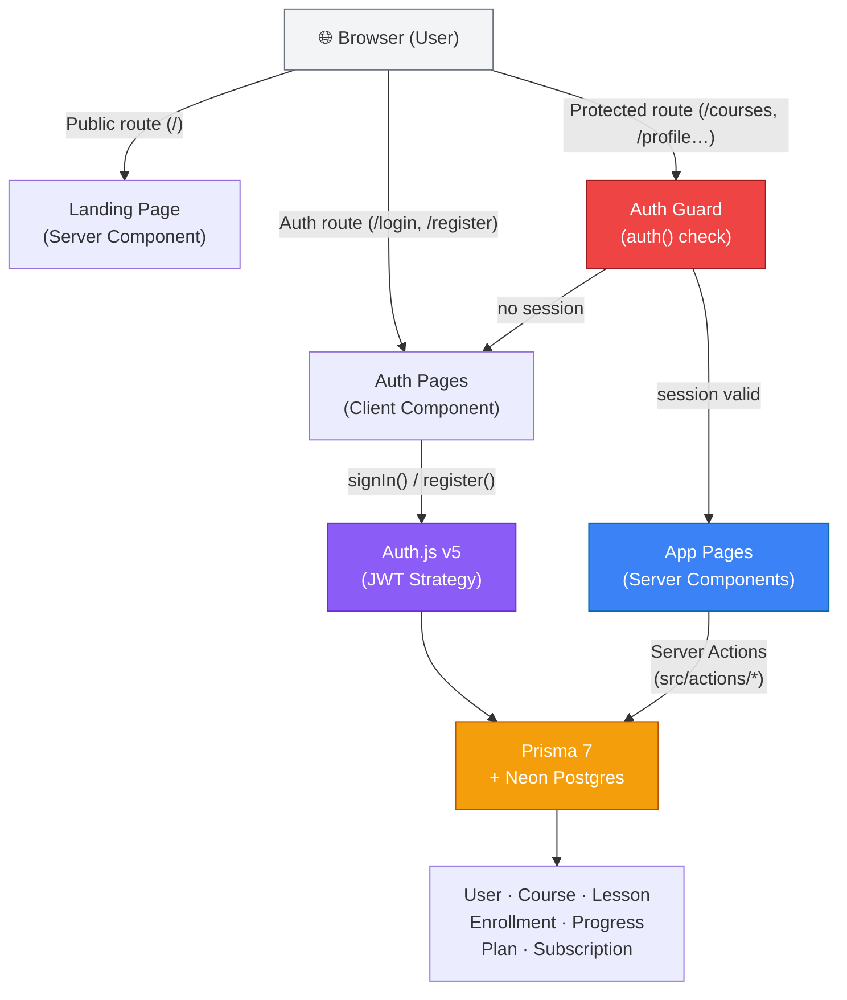
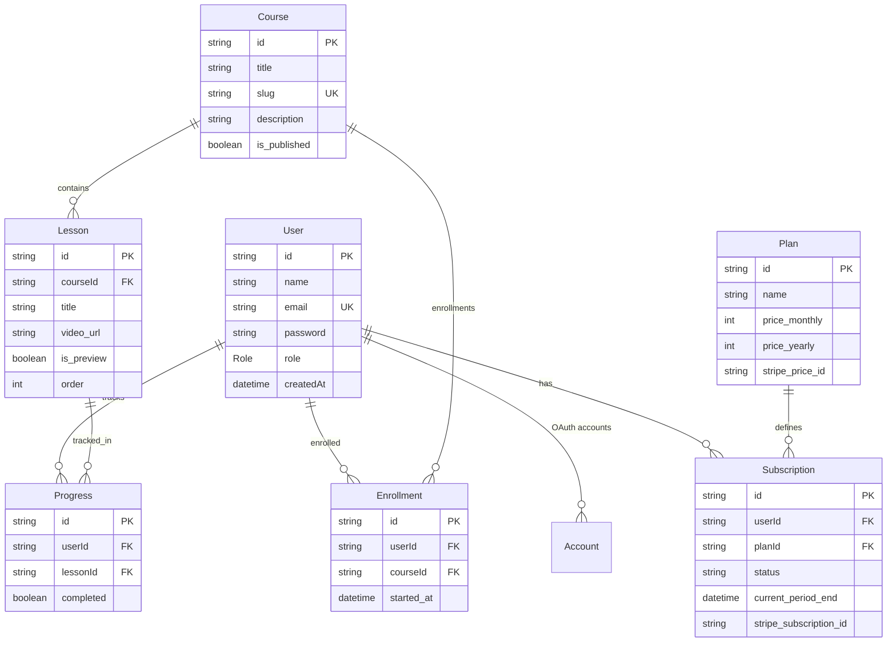

# Tech with Phantom — Modern Online Course Platform

> A full-stack LMS (Learning Management System) built with Next.js 16 App Router, Auth.js v5, Prisma 7, and Neon Postgres. Designed for course creators who want a clean, production-ready starter to sell and deliver online courses.

Live demo: *(add your demo URL here)*

## Table of Contents
- [Overview](#-overview)
- [Key Features](#-key-features)
- [Architecture](#-architecture)
- [Tech Stack](#-tech-stack)
- [Project Structure](#-project-structure)
- [Getting Started](#-getting-started)
- [Environment Variables](#-environment-variables)
- [Database & Prisma](#-database--prisma)
- [Deployment](#-deployment)
- [License](#-license)

---

## 📋 Overview

Tech with Phantom is a full-stack LMS platform that includes:
- A **public landing page** for marketing and course promotion
- A **course directory** with search and category filtering
- **Course curriculum pages** with lesson lists and free preview lessons
- An **LMS viewer** for authenticated learners
- **Auth system** with Email/Password and Google OAuth
- A **learner dashboard** with profile, orders, memberships, and settings pages

---

## ✨ Key Features

- **Authentication**: Email/password + Google OAuth via Auth.js v5 with JWT sessions
- **Course Directory**: Searchable, filterable grid of published courses
- **Lesson Viewer**: Protected lesson player with sidebar navigation
- **Free Preview**: Individual lessons can be unlocked as free previews without auth
- **Access Control**: `/courses` route is gated — only authenticated users can access
- **Learner Dashboard**: Profile info, order history, membership status, account settings
- **Responsive Design**: Fully mobile-responsive across all pages
- **SEO Ready**: Proper `<title>`, `<meta description>`, and semantic HTML on every page

---

## 🏗 Architecture

### System Flow



### Page Structure

| Route | Type | Auth Required |
|---|---|---|
| `/` | Public landing page | No |
| `/login` | Sign in | No |
| `/register` | Sign up | No |
| `/courses` | Course directory | ✅ Yes |
| `/courses/[slug]` | Course curriculum | ✅ Yes |
| `/courses/[slug]/lessons/[id]` | Lesson player | ✅ Yes (or preview) |
| `/profile` | Learner profile | ✅ Yes |
| `/orders` | Order history | ✅ Yes |
| `/memberships` | Membership status | ✅ Yes |
| `/settings` | Account settings | ✅ Yes |

### Data Model



---

## 🛠️ Tech Stack

### Frontend

| Layer | Tech |
|---|---|
| Framework | Next.js 16 (App Router) |
| Language | TypeScript |
| Styling | Tailwind CSS v4 + Vanilla CSS (CSS Variables) |
| Fonts | Plus Jakarta Sans, Inter (Google Fonts) |
| Icons | react-icons |
| Validation | Zod |

### Backend & Data

| Service | Tech |
|---|---|
| Authentication | Auth.js v5 (JWT, Credentials + Google OAuth) |
| ORM | Prisma 7 |
| Database | PostgreSQL via Neon (serverless) |
| Server Logic | Next.js Server Actions (`src/actions/`) |
| DB Adapter | `@prisma/adapter-neon` |

### Infrastructure

| Aspect | Solution |
|---|---|
| Hosting | Vercel |
| CI/CD | Vercel Auto-Deploy |
| Database | Neon Postgres (serverless) |
| Version Control | Git + GitHub |

---

## 📁 Project Structure

```
src/
├── app/
│   ├── (auth)/              # Login & Register pages
│   │   ├── login/
│   │   └── register/
│   ├── (dashboard)/         # Authenticated user pages
│   │   ├── layout.tsx       # Shared header + sidebar layout
│   │   ├── profile/
│   │   ├── orders/
│   │   ├── memberships/
│   │   └── settings/
│   ├── api/auth/            # Auth.js route handler
│   ├── courses/
│   │   ├── page.tsx         # Course directory
│   │   └── [slug]/
│   │       ├── page.tsx     # Course curriculum
│   │       └── lessons/
│   │           └── [lessonId]/page.tsx  # Lesson player
│   ├── page.tsx             # Landing page
│   ├── layout.tsx           # Root layout
│   └── globals.css          # Design tokens + Tailwind
├── actions/
│   ├── auth.actions.ts      # login(), register()
│   └── course.actions.ts    # getCourseBySlug(), getLessonById()…
├── auth.ts                  # Auth.js (PrismaAdapter + JWT callbacks)
├── auth.config.ts           # Providers: Google + Credentials
├── components/
│   ├── course/              # CourseCard, CoursesList, LessonSidebar
│   ├── dashboard/           # DashboardSidebar
│   ├── layout/              # Navbar, Footer, ProfileDropdown
│   ├── sections/            # Landing page sections
│   └── ui/                  # Shadcn-based: Button, Input, Login1
├── hooks/
│   └── useScrollReveal.ts
└── lib/
    ├── db.ts                # Prisma singleton
    └── utils.ts             # cn() utility
prisma/
├── schema.prisma
└── seed.ts
```

---

## 🚀 Getting Started

### Prerequisites

- Node.js 18+
- A PostgreSQL database (recommend [Neon](https://neon.tech) — free tier available)
- Google OAuth credentials (optional, for Google login)

### Quick Start

**1. Clone the repository**
```bash
git clone https://github.com/wayphantomme/tech-with-phantom.git
cd tech-with-phantom
```

**2. Install dependencies**
```bash
npm install
```

**3. Set up environment variables**
```bash
cp .env.example .env
# Fill in your values (see Environment Variables section below)
```

**4. Push database schema**
```bash
npx prisma db push
```

**5. Seed sample data (optional)**
```bash
npx prisma db seed
```

**6. Start development server**
```bash
npm run dev
```

Open [http://localhost:3000](http://localhost:3000)

---

## 🔐 Environment Variables

Create a `.env` file in the project root:

```env
# Database (Neon Postgres)
DATABASE_URL="postgresql://..."

# Auth.js
AUTH_SECRET="your-secret-here"   # generate: openssl rand -base64 32

# Google OAuth (optional)
GOOGLE_CLIENT_ID=""
GOOGLE_CLIENT_SECRET=""
```

---

## 📦 Database & Prisma

```bash
npx prisma db push         # Push schema to database (no migration files)
npx prisma migrate dev     # Create & apply a new migration
npx prisma db seed         # Run seed.ts to insert sample courses
npx prisma studio          # Open visual database browser
```

The Prisma client is exposed as a singleton via `src/lib/db.ts` using the `@prisma/adapter-neon` for serverless-compatible connections.

---

## ⚙️ Deployment

**Recommended: [Vercel](https://vercel.com) + [Neon](https://neon.tech)**

1. Push this repo to GitHub
2. Import the project into Vercel
3. Set all environment variables in Vercel's project settings
4. Deploy — Vercel auto-detects Next.js

> **Important**: `DATABASE_URL` and `AUTH_SECRET` are required in production. For Google OAuth, also set `GOOGLE_CLIENT_ID` and `GOOGLE_CLIENT_SECRET`, and add `https://your-domain.com/api/auth/callback/google` as an authorized redirect URI in Google Cloud Console.

---

## 📝 License

MIT