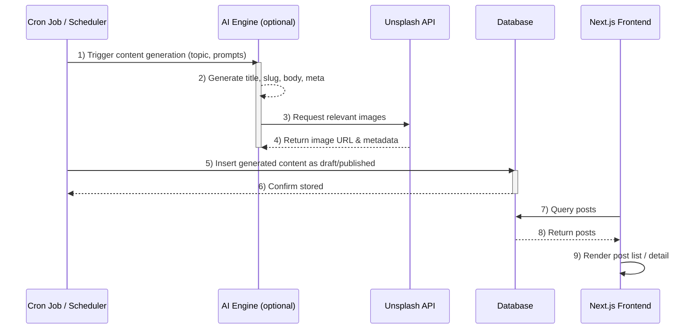
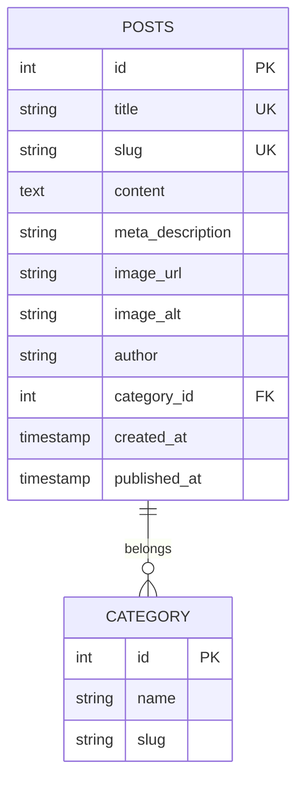

# Tech with Phantom — Modern Online Course Platform

> Modern online course platform built with Next.js and Prisma, designed to help creators, bootcamps, and small education teams launch and scale paid courses with a production-ready starter kit.

Live demo: (add your demo URL here)

## Table of Contents
- [Business Overview](#-business-overview)
- [Key Features](#-key-features)
- [Architecture](#-architecture)
- [Tech Stack](#-tech-stack)
- [Getting Started](#-getting-started)
- [Development](#-development)
- [Deployment](#-deployment)
- [Database & Prisma](#-database--prisma)
- [Contributing](#-contributing)
- [License](#-license)

---

## 💼 Business Overview

### Why Tech with Phantom?
A starter platform that reduces time-to-market for creators and organizations selling online courses. It combines a modern Next.js frontend with a type-safe Prisma-backed backend so you can focus on course content and growth instead of boilerplate.

#### Problems it solves
- Long development time to ship a course platform
- Lack of starter patterns for auth, enrollment, and course management
- Basic analytics and monetization integrations missing in many templates

#### Who it's for
- Individual course creators launching paid courses
- Small schools and bootcamps
- Product teams prototyping an education offering

#### Business opportunities
- One-time purchases, subscriptions, and bundles
- Creator marketplaces and affiliate programs
- Paid add-ons: certificates, coaching, cohort-based learning

---

## ✨ Key Features
- Landing page and course detail pages with SEO-friendly structure
- Authentication & dashboard for learners (src/auth.ts, src/auth.config.ts)
- Course CRUD and enrollment flows (src/actions/course.actions.ts)
- Prisma schema + seed data to bootstrap content (prisma/schema.prisma, prisma/seed.ts)
- Minimal, composable React components (src/components)
- Easy deploy to Vercel + managed Postgres

---

## 🏗 Architecture

### System Flow Diagram

```mermaid
flowchart LR
  A["Browser (User)"] -->|HTTP(S)| B[(Next.js App Router)]
  B --> C[Route Handlers / Server Actions (src/actions/*)]
  C --> D[Prisma Client (src/lib/db.ts)]
  D --> E[(Postgres Database)]
  B --> F[/public/static assets/]
  B --> G[Auth (src/auth.ts / src/auth.config.ts)]
  G --> D

  style A fill:#f3f4f6,stroke:#111827
  style B fill:#3b82f6,stroke:#0369a1,color:#fff
  style C fill:#10b981,stroke:#047857,color:#fff
  style D fill:#f59e0b,stroke:#b45309,color:#fff
  style E fill:#ef4444,stroke:#991b1b,color:#fff
  style G fill:#8b5cf6,stroke:#6d28d9,color:#fff
```

### Content Generation Pipeline



### Data Model



---

## 🛠️ Tech Stack

### Frontend
Layer	Tech
Framework	Next.js 16 (App Router)
Language	TypeScript
Styling	Tailwind CSS 4
Content	React Markdown + GFM
Validation	Zod

### Backend & Data
Service	Tech
ORM	Prisma 6
Database	PostgreSQL (Neon)
API	Next.js Route Handlers
AI	Google Generative AI (Gemini 3.1 Flash)
Images	Unsplash API

### Infrastructure
Aspect	Solution
Hosting	Vercel
CI/CD	Vercel Auto-Deploy
Cron Jobs	Vercel Crons / External Scheduler
Version Control	Git + GitHub

---

## 🚀 Getting Started

### Prerequisites
- Node.js 18+
- PostgreSQL (local or hosted)
- env vars (see `.env.example`)

### Quick start

1. Clone
```bash
git clone https://github.com/wayphantomme/tech-with-phantom.git
cd tech-with-phantom
```

2. Install
```bash
npm install
```

3. Create `.env.local` from `.env.example` and fill values

4. Generate Prisma client & run migrations
```bash
npx prisma generate
npx prisma migrate dev --name init
```

5. Seed database (optional)
```bash
npx prisma db seed
```

6. Run dev server
```bash
npm run dev
```
Open http://localhost:3000

---

## 💻 Development

Project layout (relevant parts)
```
src/
  app/                # Next.js App Router pages & API routes
  actions/            # Business logic (auth, course operations)
  auth.ts             # Auth helpers
  auth.config.ts      # Auth config
  components/         # UI components
  lib/                # db.ts (Prisma client wrapper), utils
prisma/
  schema.prisma
  seed.ts
public/
  favicon, images
```

Useful scripts (package.json)
```bash
npm run dev        # Start dev server
npm run build      # Build for production
npm run start      # Start production server
npm run lint       # Run ESLint
# Prisma
npx prisma generate
npx prisma migrate dev
npx prisma db seed
```

---

## 📦 Database & Prisma
- Models live in `prisma/schema.prisma`.
- `prisma/seed.ts` contains sample courses and users to bootstrap development.
- Use `src/lib/db.ts` to access a shared Prisma client instance in server code.

Commands
```bash
npx prisma studio       # Visual DB browser
npx prisma migrate dev  # Create & apply migrations
npx prisma db seed      # Run seeder
```

---

## ⚙️ Deployment
Recommended: Vercel (Next.js first-class). Use a managed Postgres (Neon, Supabase, RDS).

Steps
1. Push repo to GitHub and import into Vercel
2. Set required environment variables in Vercel
3. Run migrations manually or as part of your deployment pipeline

Notes
- Ensure NEXTAUTH_SECRET and DATABASE_URL are set in production.
- If adding payments, configure webhook endpoints and secret handling carefully.

---

## 🤝 Contributing
- Fork → feature branch → PR
- Keep UI components presentational; business logic goes to src/actions
- Add tests and type checks for new features

---

## 📝 License
MIT

---

If you'd like, I can also:
- add a `CONTRIBUTING.md` with contribution guidelines,
- create ISSUE/PR templates,
- add a GitHub Actions workflow for lint/typecheck/build, or
- add a `docker-compose.yml` for Postgres-based local dev.

Tell me which you'd like and I'll create them.