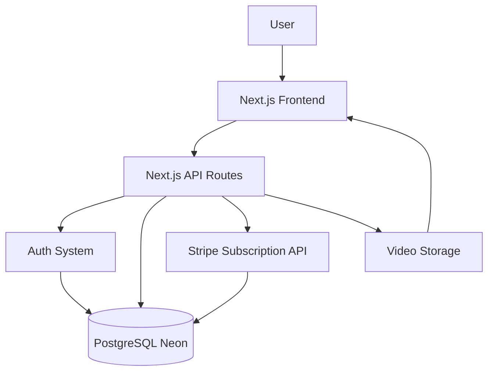
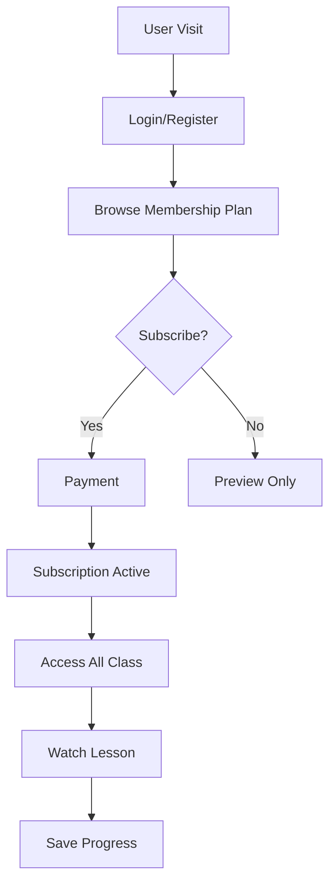
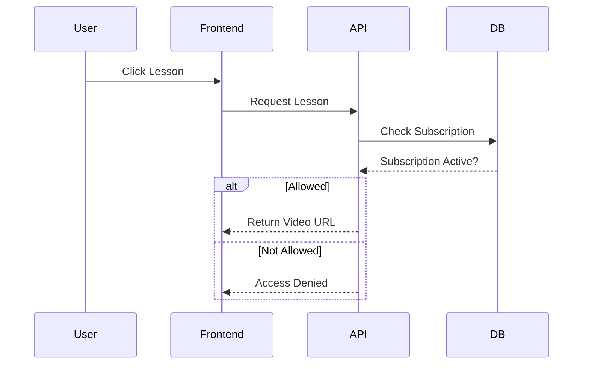

# 📘 Product Requirements Document (PRD)

## Tech with Phantom — Online Class Platform (MVP)

### 1. 🎯 Objective

Membangun platform online class berbasis **membership** untuk **Tech with Phantom** yang berfokus pada:

* Menjual akses membership ke seluruh class
* Mengelola user, subscription, dan progress belajar
* Monetisasi dengan paket Basic dan Premium
* Siap dikembangkan ke pasar global (USD)

---

### 2. 👤 User Roles

#### 1. Student

* Register / login
* Pilih membership plan
* Akses semua class sesuai plan aktif
* Nonton video
* Track progress

#### 2. Admin / Creator

* Upload class
* Manage lesson
* Monitor subscriber
* Melihat analytics

---

### 3. 🔑 Core Features (MVP)

#### Auth

* Email/password login
* Google OAuth

#### Membership

* List plan membership
* Detail benefit plan
* Upgrade / downgrade plan
* Status subscription aktif / expired

#### Course

* List class
* Detail class
* Video lesson (YouTube unlisted / storage)
* Preview lesson untuk non-member

#### Payment

* Subscribe membership (recurring)
* Paket Basic: Rp99.000/bulan
* Paket Premium: Rp149.000/bulan

#### Dashboard

* Student: active plan, progress, enrolled classes
* Admin: manage class, subscriber, analytics

---

### 4. 🧠 Business Logic

#### Subscription Logic

IF user punya subscription aktif → akses semua class sesuai plan
ELSE → locked content

#### Progress Tracking

* Simpan lesson progress (completed / not)
* Hitung % completion per class
* Simpan riwayat belajar user

#### Access Control

* Middleware cek:

  * login
  * subscription aktif
  * entitlement plan

#### Billing Logic

* Stripe subscription untuk recurring payment
* Support cancel, renew, dan upgrade plan
* Webhook untuk update status subscription

---

### 5. 🧱 Tech Stack

### Frontend

* Next.js (App Router)
* Tailwind CSS
* Zustand / React Query

### Backend

* Next.js API Routes / Server Actions
* Node.js

### Database

* PostgreSQL (Neon)

### Auth

* NextAuth.js / Auth.js

### Storage / Video

* YouTube Unlisted OR
* Cloudflare R2 / AWS S3

### Payment

* Stripe Subscription

### Deployment

* Vercel

---

### 6. 📦 Database Schema (Simplified)

User

* id
* email
* password
* role

Plan

* id
* name
* price_monthly
* price_yearly
* stripe_price_id
* features

Subscription

* id
* user_id
* plan_id
* status
* current_period_end
* stripe_customer_id
* stripe_subscription_id

Course

* id
* title
* description
* slug
* is_published

Lesson

* id
* course_id
* title
* video_url
* is_preview

Enrollment

* id
* user_id
* course_id
* started_at

Progress

* id
* user_id
* lesson_id
* completed

---

### 7. 🔄 User Flow

1. User signup/login
2. Browse membership plan
3. Subscribe plan
4. Access class
5. Track progress
6. Renew / upgrade / cancel subscription

---

## 🧩 System Architecture

### High Level

User → Frontend (Next.js) → API → Database (Neon)

---

## 🧭 Mermaid Diagram – Architecture



---

## 🔄 Mermaid Diagram – User Flow



---

## 🧠 Backend Logic Flow



---

## ⚙️ Folder Structure (Next.js)

```
/app
  /login
  /dashboard
  /pricing
  /course
    /[id]
  /lesson
    /[id]
  /billing

/lib
  db.ts
  auth.ts

/api
  /auth
  /course
  /subscription
  /payment

/components
  CourseCard.tsx
  VideoPlayer.tsx
  PricingCard.tsx
```

---

## 🚀 Scaling (Future)

* AI recommendation (class suggestion)
* Affiliate system
* Community (Discord / forum)
* Mobile app
* Annual plan dan family/team plan
* Multi-currency pricing (IDR / USD)

---

## 💰 Monetization

* Paket Basic: Rp99.000/bulan
* Paket Premium: Rp149.000/bulan
* Annual plan dengan diskon
* Upsell upgrade plan
* Bundle access untuk premium member

---

## 🔥 Summary

Core idea:

* Next.js = fullstack
* Neon = database
* Stripe = subscription payment
* YouTube/S3 = video

Focus:
👉 Membership MVP → recurring revenue → validate → scale
